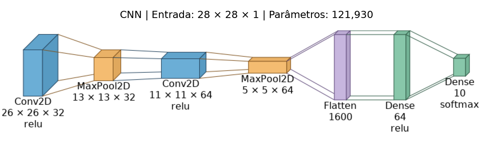
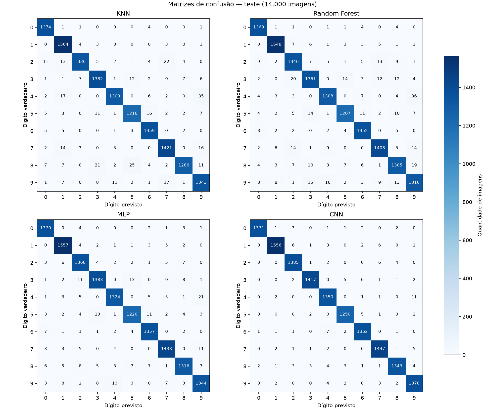

# Classificação de dígitos manuscritos — MNIST

Mini-projeto avaliativo do Módulo 02 de Desenvolvimento de IA para Análise Preditiva. O projeto compara algoritmos clássicos e redes neurais para reconhecer dígitos de 0 a 9, examina erros e confiança das previsões e aplica o modelo selecionado a fotografias de dígitos próprios.

A implementação, as saídas executadas e as interpretações estão em [projeto.ipynb](projeto.ipynb). A CNN atingiu **98,3571% de acurácia nas 14.000 imagens de teste** e acertou **19 das 20 imagens próprias reservadas**. O resultado nas fotos é exploratório e não estima o desempenho para outras pessoas ou condições de captura.



## Métodos e tecnologias

- Python 3.12, NumPy e pandas para preparação e análise dos dados.
- scikit-learn para MNIST via OpenML, divisão estratificada, KNN, Random Forest e métricas.
- TensorFlow 2.21.0 / Keras 3.15.1 para MLP e CNN.
- SciPy e Pillow para calibração e processamento das imagens próprias.
- Matplotlib e VisualKeras 0.2.0 para gráficos e diagramas das redes.
- Jupyter para organizar código, resultados e interpretação; Git e GitHub para versionamento.

As versões do ambiente estão registradas em [requirements.txt](requirements.txt).

## Protocolo do experimento

Usamos `mnist_784`, versão 1, com 70.000 imagens de 28 × 28 pixels e dez classes. A auditoria não encontrou imagens exatamente duplicadas; imagens apenas semelhantes não foram auditadas.

| Partição | Imagens | Função |
|---|---:|---|
| Treino — 60% | 42.000 | Ajustar os modelos |
| Validação — 10% | 7.000 | Selecionar configurações e acompanhar a parada das redes |
| Calibração — 10% | 7.000 | Ajustar a temperatura da CNN já selecionada |
| Teste — 20% | 14.000 | Avaliar os modelos e as probabilidades sem novos ajustes |

A divisão é estratificada, com semente 42, e própria deste projeto; não corresponde à divisão oficial do MNIST em 60.000/10.000. As partições são comuns aos modelos. Os pixels são convertidos para `float32` e divididos por 255. KNN, Random Forest e MLP recebem 784 atributos; a CNN recebe as mesmas imagens reorganizadas em 28 × 28 × 1.

### Configurações comparadas

| Família | Variações avaliadas | Configuração selecionada |
|---|---|---|
| KNN | 3 ou 5 vizinhos; pesos uniformes ou por distância | 3 vizinhos, pesos por distância |
| Random Forest | 100 ou 200 árvores; profundidade 20 ou sem limite | 200 árvores, sem limite explícito |
| MLP | Camadas (128, 64) ou (256, 128); L2 de 0,0001 ou 0,001 | (256, 128), L2 de 0,0001 |
| CNN | Uma arquitetura fixa, adicional às três famílias principais | Conv32 → Pool → Conv64 → Pool → Dense64 → saída de 10 classes |

São quatro combinações por família principal, doze no total. A CNN é uma comparação adicional sem busca equivalente de hiperparâmetros. As redes usam Adam, taxa de aprendizado 0,001, lotes de 64 e até 30 épocas, com parada antecipada pela perda de validação e restauração dos melhores pesos.

O critério de seleção é o F1 ponderado na validação; os critérios de desempate estão documentados no notebook. A CNN foi escolhida antes do teste para calibração e imagens próprias. A MLP foi a referência entre as três famílias principais no bootstrap pareado.

## Resultados no teste

| Modelo | Acurácia | Precisão ponderada | Recall ponderado | F1 ponderado | Ajuste (s) | Inferência (s) |
|---|---:|---:|---:|---:|---:|---:|
| CNN | 98.3571% | 0.983612 | 0.983571 | 0.983553 | 19.714 | 0.317 |
| MLP | 97.6571% | 0.976573 | 0.976571 | 0.976551 | 6.360 | 0.102 |
| KNN | 97.0286% | 0.970562 | 0.970286 | 0.970257 | 0.005 | 2.677 |
| Random Forest | 96.5714% | 0.965740 | 0.965714 | 0.965695 | 4.353 | 0.104 |

A CNN acertou 13.770 imagens, 98 a mais que a MLP. A maior confusão da CNN foi **9 → 4**, com 16 exemplos. O dígito 9 apresentou o menor F1 em todos os modelos.

O tempo de ajuste corresponde somente à configuração selecionada, e o de inferência ao lote de 14.000 imagens. São medidas de uma execução local, sem benchmark repetido; equipamento, paralelismo e custos das chamadas afetam os valores. A CNN apresentou maior tempo de ajuste e a MLP menor tempo de inferência nesta execução.

A diferença de F1 CNN − MLP foi **0,007002**, com intervalo percentil de 95% **[0,004786; 0,009285]**, obtido por 1.000 reamostragens pareadas. O intervalo é condicionado aos modelos ajustados e à hipótese de exemplos independentes; não inclui a variabilidade de novos treinamentos ou seleções.



### Calibração das probabilidades

A temperatura foi ajustada nas 7.000 imagens de calibração: **T = 1,009045**. A transformação preservou as classes previstas. No teste, a log loss passou de 0,05217654 para 0,05218850, e o ECE de dez intervalos passou de 0,00185767 para 0,00206713. Ambas as medidas pioraram discretamente. A pequena melhora no conjunto usado para ajustar a temperatura não se reproduziu no teste; não houve benefício observado nessas medidas.

### Classes ausentes do treino — desafios A e B

Uma nova Random Forest com 200 árvores e profundidade máxima 20 foi ajustada sem os dígitos 4 e 7, usando 33.531 imagens. Nas 2.824 imagens de teste dessas classes, a acurácia foi zero por construção: o classificador só emite as oito classes aprendidas.

A maioria dos exemplos foi atribuída à classe 9. Houve **106 previsões incorretas com confiança de pelo menos 90%**. Alta confiança entre classes conhecidas não garante reconhecer uma classe ausente. O notebook explica essa limitação e a diferença entre classificação e um mecanismo de rejeição, que não foi implementado neste experimento.

### Imagens próprias — desafio C

Três fotografias fornecem trinta dígitos rotulados. As cópias PNG orientadas, as coordenadas de recorte e os parâmetros do processamento estão em [data/imagens_proprias](data/imagens_proprias). As cópias incluídas são suficientes para executar o notebook; os arquivos HEIC originais não são necessários.

O processamento converte para cinza, estima o fundo, destaca o traço escuro como intensidade clara sobre fundo preto, remove componentes pequenos, expande o traço, redimensiona proporcionalmente e centraliza pelo centro de massa em 28 × 28. A saída já está normalizada em [0, 1].

| Fotografia de origem | Finalidade | Acertos |
|---|---|---:|
| IMG_7057.heic | Desenvolvimento do processamento | 9/10 |
| IMG_7058.heic | Avaliação reservada | 10/10 |
| IMG_7059.heic | Avaliação reservada | 9/10 |

As vinte imagens reservadas foram avaliadas com o processamento fixado, sem novos ajustes nos pesos ou na temperatura: **19/20 acertos (95%)**. O único erro foi um **9 previsto como 3, com confiança de 98,53%**. Os dez exemplos de desenvolvimento são apresentados separadamente.

A calibração feita no MNIST não garante probabilidades adequadas às fotografias próprias. A luminosidade pode alterar contraste e representação dos traços, mas o experimento não isolou esse fator; não é possível atribuir o erro observado à iluminação.

As galerias apresentam cada imagem ao lado das dez probabilidades: [desenvolvimento](reports/figures/probabilidades_IMG_7057.png), [primeira foto de avaliação](reports/figures/probabilidades_IMG_7058.png) e [segunda foto de avaliação](reports/figures/probabilidades_IMG_7059.png).

## Instalação

Clone o repositório e entre na pasta:

```bash
git clone https://github.com/Luizhprovin/mnist-digit-classification.git
cd mnist-digit-classification
```

Em macOS ou Linux, com Python 3.12 instalado:

```bash
python3.12 -m venv .venv
source .venv/bin/activate
python -m pip install -r requirements.txt
```

Em Windows, use `py -3.12 -m venv .venv` e ative o ambiente com `.venv\Scripts\Activate.ps1` no PowerShell antes de instalar as dependências. O ambiente foi executado e verificado em macOS com Apple Silicon; não houve validação independente em Windows ou Linux.

## Execução

Abra [projeto.ipynb](projeto.ipynb) no VS Code com as extensões Python e Jupyter, selecione `.venv` como kernel e use **Reiniciar Kernel e Executar Tudo**. Execute as células na ordem. A configuração inicial dos logs nativos do TensorFlow deve ser aplicada antes da importação da biblioteca.

Também é possível executar na raiz do projeto pelo terminal:

```bash
python -m jupyter nbconvert --execute --to notebook --inplace projeto.ipynb --ExecutePreprocessor.timeout=600
```

A primeira execução baixa o [MNIST do OpenML](https://www.openml.org/d/554) e requer internet. O cache fica em `data/cache/` e é reutilizado nas execuções seguintes. O notebook treina os modelos e atualiza as tabelas, figuras e saídas. O tempo total varia com o equipamento. As sementes e versões auxiliam a reprodução, mas pequenas diferenças numéricas podem ocorrer entre plataformas.

## Organização

```text
projeto.ipynb                 # Código, saídas e interpretação das fases
README.md                    # Métodos, resultados e instruções
requirements.txt             # Dependências com versões
.python-version              # Python 3.12
.vscode/                     # Seleção do ambiente no editor
data/imagens_proprias/       # Fotos PNG, manifesto e parâmetros
reports/figures/              # Matrizes, curvas, diagramas e galerias
reports/tables/               # Resultados em CSV
docs/ENTREGA.md               # Correspondência com os requisitos e pendências externas
```

`data/cache/`, `.venv/` e `artifacts/` são ignorados pelo Git. MLP e CNN são salvas localmente em `artifacts/melhor_mlp.keras` e `artifacts/cnn.keras`; os modelos e demais arquivos desse diretório são recriados pelo notebook.

## Versionamento

As etapas foram registradas em commits próprios, com branches preservadas. As primeiras integrações foram locais por avanço direto de `develop` (fast-forward); o fechamento local usa commits de merge. O repositório público mantém as branches de cada etapa. A versão de entrega é integrada de `develop` para `main` por pull request. O histórico não atribui pull requests às etapas integradas apenas localmente.

| Branch | Objetivo |
|---|---|
| `codex/estrutura` | Ambiente e notebook inicial |
| `codex/eda` | Carregamento e análise exploratória |
| `codex/preprocessamento` | Divisão e normalização |
| `codex/knn` | Ajuste e comparação do KNN |
| `codex/random-forest` | Ajuste e comparação da Random Forest |
| `codex/mlp` | MLP e auditoria de duplicatas |
| `codex/cnn` | CNN e diagramas das redes |
| `codex/calibracao` | Temperatura da CNN e correção de avisos |
| `codex/avaliacao` | Teste, matrizes, confiabilidade e bootstrap |
| `codex/classes-ocultadas` | Desafios A e B |
| `codex/imagens-proprias` | Processamento e dez imagens de desenvolvimento |
| `codex/avaliacao-proprias` | Vinte imagens reservadas e probabilidades dos trinta dígitos |
| `codex/documentacao` | Revisão, conclusão geral e documentação de entrega |
| `codex/publicacao` | Nome público e referências do repositório |

## Limitações e melhorias possíveis

Os resultados usam uma divisão e uma semente; a busca de hiperparâmetros é pequena. As fotos próprias representam uma pessoa e poucas condições de captura. A confiança não funciona como garantia de acerto nem como detector de classes desconhecidas.

Melhorias futuras incluem avaliar outras pessoas, controlar a iluminação ao fotografar os mesmos dígitos, experimentar aumento de dados somente no desenvolvimento e avaliar rejeição de entradas desconhecidas. Novos ajustes exigiriam novos dados de desenvolvimento e uma nova amostra reservada. Uma interface para desenhar dígitos é uma extensão possível; a entrega atual é o notebook.

## Referências

- [MNIST no OpenML](https://www.openml.org/d/554).
- [TensorFlow — Conv2D](https://www.tensorflow.org/api_docs/python/tf/keras/layers/Conv2D) e [EarlyStopping](https://www.tensorflow.org/api_docs/python/tf/keras/callbacks/EarlyStopping).
- [VisualKeras](https://github.com/paulgavrikov/visualkeras).
- [Guo et al. (2017) — On Calibration of Modern Neural Networks](https://proceedings.mlr.press/v70/guo17a.html).
