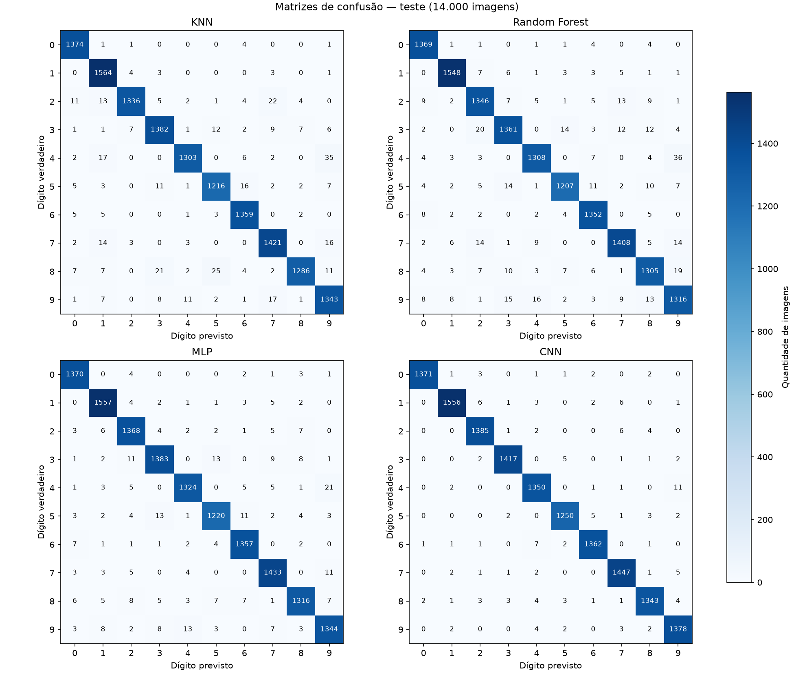

# Classificação de dígitos manuscritos — MNIST

Este projeto compara algoritmos clássicos e redes neurais para reconhecer dígitos de 0 a 9, examina erros e confiança das previsões e aplica o modelo selecionado a fotografias de dígitos próprios.

A implementação, as saídas executadas e as interpretações estão em [projeto.ipynb](projeto.ipynb). A CNN atingiu **98,9929% de acurácia nas 14.000 imagens de teste** e acertou **as 20 imagens próprias reservadas**. O resultado nas fotos é exploratório e não estima o desempenho para outras pessoas ou condições de captura.

## Como abrir e executar localmente

O notebook já contém os resultados e gráficos da execução registrada. Para ler a análise, abra `projeto.ipynb` no VS Code com a extensão Jupyter. Para executar código ou usar a demonstração, prepare o ambiente abaixo.

### 1. Requisitos

- **Python 3.12, 64 bits**, disponível em [python.org](https://www.python.org/downloads/).
- Internet para instalar os pacotes e, se for executar o experimento completo pela primeira vez, baixar o MNIST do OpenML.
- Windows x64, Linux x86-64 ou macOS com Apple Silicon compatível com as versões de `requirements.txt`. As bibliotecas atuais para Apple Silicon exigem macOS 14 ou superior.
- Não é necessária uma placa de vídeo dedicada, CUDA ou conta em serviço de nuvem. O projeto pode executar na CPU.
- Para visualizar e executar interativamente o notebook: [VS Code](https://code.visualstudio.com/) com as extensões **Python** e **Jupyter**, ambas da Microsoft. A execução pelo terminal dispensa o editor.

Reserve espaço para o ambiente Python: as bibliotecas científicas ocupam mais de 1 GB. O tempo de instalação e de treinamento depende do computador. As versões principais do experimento estão fixadas em `requirements.txt`; as dependências indiretas são resolvidas pelo pip conforme a plataforma.

### 2. Obter e extrair os arquivos

**Pelo ZIP de entrega `mnist-digit-classification-entrega.zip`:** extraia o arquivo inteiro e abra a pasta `mnist-digit-classification`, onde ficam este README, `requirements.txt` e `projeto.ipynb`. Não execute arquivos de dentro do ZIP. Esse pacote inclui a CNN treinada e sua calibração em `artifacts/`, permitindo testar a demonstração sem retreinar.

**Pelo GitHub:** use **Code → Download ZIP**, extraia a pasta, ou faça o clone:

```bash
git clone https://github.com/Luizhprovin/mnist-digit-classification.git
cd mnist-digit-classification
```

O ZIP automático do GitHub e o clone contêm o código, fotos e resultados, mas **não incluem os modelos treinados**, pois `artifacts/` é ignorado pelo Git. Nesses casos, execute o notebook completo, conforme a seção 5, antes de iniciar a demonstração.

Todos os comandos seguintes devem ser executados em um terminal aberto **na pasta que contém `requirements.txt` e `projeto.ipynb`**. No VS Code, use **Arquivo → Abrir Pasta** e depois **Terminal → Novo Terminal**.

### 3. Criar o ambiente e instalar

#### Windows — PowerShell

```powershell
py -3.12 --version
py -3.12 -m venv .venv
.\.venv\Scripts\python.exe -m pip install --upgrade pip
.\.venv\Scripts\python.exe -m pip install -r requirements.txt
.\.venv\Scripts\python.exe -m pip check
.\.venv\Scripts\python.exe -m ipykernel install --sys-prefix --name mnist --display-name "Python 3.12 (MNIST)"
```

A primeira linha deve mostrar `Python 3.12.x`. Os comandos usam o Python do ambiente diretamente; não é necessário ativar scripts nem alterar a política de execução do PowerShell.

#### macOS ou Linux

```bash
python3.12 --version
python3.12 -m venv .venv
.venv/bin/python -m pip install --upgrade pip
.venv/bin/python -m pip install -r requirements.txt
.venv/bin/python -m pip check
.venv/bin/python -m ipykernel install --sys-prefix --name mnist --display-name "Python 3.12 (MNIST)"
```

Se a instalação terminar corretamente, `pip check` deve responder `No broken requirements found.`. Crie o ambiente no próprio computador; não copie `.venv` de outra máquina. Git e Node.js não são necessários para abrir o pacote e executar o notebook ou a demonstração.

### 4. Testar a demonstração com a CNN pronta

Confirme que existem **os dois arquivos** `artifacts/cnn.keras` e `artifacts/calibracao_cnn.json`. Eles acompanham o ZIP de entrega preparado; no clone ou ZIP automático do GitHub, são gerados pelo notebook.

No Windows:

```powershell
.\.venv\Scripts\python.exe -m mnist_demo.servidor
```

No macOS ou Linux:

```bash
.venv/bin/python -m mnist_demo.servidor
```

Abra **http://127.0.0.1:8765** no navegador. Mantenha o terminal aberto. A interface deve indicar **CNN Pronta**; na aba **Exemplos do Estudo**, escolha um exemplo para conferir a previsão e as probabilidades. O primeiro pedido pode demorar mais porque carrega o TensorFlow e o modelo.

Também é possível desenhar um único dígito ou enviar um recorte em PNG, JPEG ou WebP. Escolha o fundo correspondente à imagem. Fotos HEIC e folhas inteiras com vários dígitos não são entradas aceitas diretamente: use um recorte de um dígito em formato compatível. A requisição tem limite de 8 MiB, incluindo a codificação base64, e a imagem deve ter no máximo 12 milhões de pixels.

Encerre com **Ctrl+C** no terminal. Para usar outra porta, acrescente `--porta 8766` ao comando e abra `http://127.0.0.1:8766`. A demonstração funciona localmente e não precisa de internet depois da instalação quando os artefatos estão presentes. As imagens enviadas não são salvas.

### 5. Executar o experimento completo

No VS Code:

1. Abra a pasta do projeto e o arquivo `projeto.ipynb`.
2. Clique em **Selecionar Kernel** no canto superior direito.
3. Selecione **Python 3.12 (MNIST)** ou o interpretador `.venv` criado na seção 3.
4. Use **Reiniciar Kernel e Executar Tudo**. Aguarde as células terminarem na ordem.
5. Confira as tabelas, os gráficos e a conclusão final. O diretório `artifacts/` passará a conter os modelos e os metadados gerados.

Para executar sem VS Code, use o terminal. No Windows:

```powershell
.\.venv\Scripts\python.exe -m jupyter nbconvert --execute --to notebook --inplace projeto.ipynb --ExecutePreprocessor.kernel_name=mnist --ExecutePreprocessor.timeout=1800
```

No macOS ou Linux:

```bash
.venv/bin/python -m jupyter nbconvert --execute --to notebook --inplace projeto.ipynb --ExecutePreprocessor.kernel_name=mnist --ExecutePreprocessor.timeout=1800
```

O limite é de 1.800 segundos **por célula**, não uma previsão da duração total. Se uma máquina mais lenta exceder esse limite, aumente o valor. Na primeira execução, o MNIST é baixado para `data/cache/`; execuções seguintes reutilizam o cache. As três fotografias próprias já estão incluídas no pacote e não exigem os originais HEIC.

**Reexecutar treina os modelos e sobrescreve as saídas do notebook, as tabelas, as figuras e os artefatos locais.** Para comparar com a execução entregue, mantenha uma cópia dos arquivos originais antes de reexecutar. Mesmo com sementes e versões fixadas, diferenças entre equipamentos e dependências podem alterar tempos e resultados numéricos. Os textos registram a execução entregue e precisam ser confrontados com os novos números se houver diferenças.

### 6. Verificações opcionais

No Windows:

```powershell
.\.venv\Scripts\python.exe -m unittest discover -s tests -v
```

No macOS ou Linux:

```bash
.venv/bin/python -m unittest discover -s tests -v
```

A suíte Python tem 19 testes. O teste de inferência completa é pulado quando os modelos estão ausentes; para executá-lo, use o ZIP com os artefatos ou gere-os pelo notebook. Os testes documentais comparam afirmações selecionadas com os CSVs da execução registrada; uma reexecução com resultados diferentes pode exigir atualização dos textos.

Os nove testes de concorrência da interface são opcionais e exigem **Node.js 24**:

```bash
node --test tests/web/app.test.cjs
```

Node.js não participa da execução do modelo. No repositório, o GitHub Actions executa essas verificações, checa a sintaxe Python e valida o formato do notebook; o CI não retreina as redes.

### 7. Solução de problemas

| Sintoma | Como resolver |
|---|---|
| `py` ou `python3.12` não encontrado | Instale Python 3.12 e abra um novo terminal. No Windows, confira se o instalador incluiu o Python Launcher. |
| `requirements.txt` não encontrado | Abra o terminal na pasta extraída que contém esse arquivo, não na pasta superior nem dentro do ZIP. |
| `ModuleNotFoundError` | Repita a instalação com o executável de `.venv` e selecione esse mesmo ambiente como kernel. |
| `No matching distribution found` | Confira Python 3.12, arquitetura de 64 bits e sistema compatível. macOS Intel e Windows ARM não foram validados para este conjunto de versões. |
| Erro de DLL ao importar TensorFlow no Windows | Confira o [Microsoft Visual C++ Redistributable x64](https://learn.microsoft.com/en-us/cpp/windows/latest-supported-vc-redist), exigido pelo TensorFlow, e reinicie o terminal. |
| Kernel `mnist` não encontrado | Execute novamente o comando `ipykernel install --sys-prefix` da seção 3 usando o Python de `.venv`. |
| Erro no download do OpenML | Verifique acesso à internet, proxy ou bloqueio da rede. O cache do MNIST não acompanha a entrega. |
| Interface mostra `Modelo Ausente` | Confira os dois arquivos em `artifacts/`; se usou o GitHub, execute o notebook completo primeiro. |
| Endereço indisponível ou porta ocupada | Mantenha o servidor aberto no terminal ou use `--porta 8766` e o endereço correspondente. |
| `Nenhum traço encontrado` | Envie um recorte legível de um dígito, com contraste, e confira a opção de fundo. |

O treinamento original foi executado em macOS com Apple Silicon. As verificações de portabilidade e da cópia de entrega estão descritas na seção **Validação da entrega**; não se presume execução em Windows apenas pela existência dos comandos acima.

## Métodos e tecnologias

- Python 3.12, NumPy e pandas para preparação e análise dos dados.
- scikit-learn para MNIST via OpenML, divisão estratificada, KNN, Random Forest e métricas.
- TensorFlow 2.21.0 / Keras 3.15.1 para MLP e CNN.
- SciPy e Pillow para calibração e processamento das imagens próprias.
- Matplotlib e VisualKeras 0.2.0 para gráficos e diagramas das redes.
- Jupyter para organizar código, resultados e interpretação; Git e GitHub para versionamento.

As versões do ambiente estão registradas em [requirements.txt](requirements.txt).

## Protocolo do experimento

Usamos `mnist_784`, versão 1, com 70.000 imagens de 28 × 28 pixels e dez classes. A auditoria não encontrou imagens exatamente duplicadas; imagens apenas semelhantes não foram auditadas.

| Partição | Imagens | Função |
|---|---:|---|
| Treino — 60% | 42.000 | Ajustar os modelos |
| Validação — 10% | 7.000 | Selecionar configurações e acompanhar a parada das redes |
| Calibração — 10% | 7.000 | Ajustar a temperatura da CNN já selecionada |
| Teste — 20% | 14.000 | Avaliar os modelos e as probabilidades sem novos ajustes |

A divisão é estratificada, com semente 42, e própria deste projeto; não corresponde à divisão oficial do MNIST em 60.000/10.000. As partições são comuns aos modelos. Os pixels são convertidos para `float32` e divididos por 255. KNN, Random Forest e MLP recebem 784 atributos; a CNN recebe as mesmas imagens reorganizadas em 28 × 28 × 1.

### Configurações comparadas

| Família | Variações avaliadas | Configuração selecionada |
|---|---|---|
| KNN | 3 ou 5 vizinhos; pesos uniformes ou por distância | 3 vizinhos, pesos por distância |
| Random Forest | 100 ou 200 árvores; profundidade 20 ou sem limite | 200 árvores, sem limite explícito |
| MLP | Camadas (128, 64) ou (256, 128); L2 de 0,0001 ou 0,001 | (256, 128), L2 de 0,0001 |
| CNN | Uma arquitetura fixa, adicional às três famílias principais | Conv32 → Pool → Conv64 → Pool → Dense64 → saída de 10 classes |

São quatro combinações por família principal, doze no total. A CNN é uma comparação adicional sem busca equivalente de hiperparâmetros. As redes usam Adam, taxa de aprendizado 0,001, lotes de 64 e até 30 épocas, com parada antecipada pela acurácia de validação, paciência de cinco épocas e restauração dos melhores pesos. A regra é a mesma nas duas redes, para padronizar o limite de épocas e a regra de parada, embora épocas efetivas e custo continuem diferentes; acompanhamos a acurácia porque a perda de validação oscila neste problema e interrompia o ajuste antes da convergência.

O critério de seleção é o F1 ponderado na validação; os critérios de desempate estão documentados no notebook. Em cada execução, a escolha da CNN para calibração e imagens próprias utiliza a validação. A MLP foi a referência entre as três famílias principais no bootstrap pareado.

**Histórico da avaliação:** a regra de parada das redes foi revisada após uma primeira execução, e os resultados foram recalculados nas mesmas partições e fotografias. Treinamento e calibração não recebem o teste, mas seus resultados anteriores já eram conhecidos. Não apresentamos esse histórico como uma única avaliação cega; futuras decisões de ajuste exigem uma nova amostra reservada.

## Resultados no teste

| Modelo | Acurácia | Precisão ponderada | Recall ponderado | F1 ponderado | Ajuste (s) | Inferência (s) |
|---|---:|---:|---:|---:|---:|---:|
| CNN | 98.9929% | 0.989949 | 0.989929 | 0.989933 | 50.003 | 0.295 |
| MLP | 97.6571% | 0.976573 | 0.976571 | 0.976551 | 7.465 | 0.090 |
| KNN | 97.0286% | 0.970562 | 0.970286 | 0.970257 | 0.005 | 2.216 |
| Random Forest | 96.5714% | 0.965740 | 0.965714 | 0.965695 | 3.735 | 0.087 |

A CNN acertou 13.859 imagens, 187 a mais que a MLP. A maior confusão da CNN foi **4 → 9**, com 11 exemplos. O dígito 9 apresentou o menor F1 no KNN, na Random Forest e na MLP; na CNN o menor F1 ficou com o dígito 4 (0,9861), seguido de perto pelo 9 (0,9864).

O tempo de ajuste corresponde somente à configuração selecionada, e o de inferência ao lote de 14.000 imagens. São medidas de uma execução local, sem benchmark repetido; equipamento, paralelismo e custos das chamadas afetam os valores. A CNN apresentou maior tempo de ajuste. A Random Forest teve a menor duração de inferência nesta execução (0,0874 s), muito próxima da MLP (0,0897 s); a diferença isolada não estabelece vantagem consistente.

A diferença de F1 CNN − MLP foi **0,013382**, com intervalo percentil de 95% **[0,011304; 0,015602]**, obtido por 1.000 reamostragens pareadas. O intervalo é condicionado aos modelos ajustados e à hipótese de exemplos independentes; não inclui a variabilidade de novos treinamentos ou seleções.



### Calibração das probabilidades

A temperatura foi ajustada nas 7.000 imagens de calibração: **T = 1,512363**. A transformação preservou as classes previstas. No teste, a log loss passou de 0,03756771 para 0,03271348, e o ECE de dez intervalos passou de 0,00489486 para 0,00099256. Ambas as medidas melhoraram: a log loss caiu cerca de 12,9% e o ECE ficou aproximadamente cinco vezes menor. Uma temperatura acima de 1 aproxima as probabilidades entre si, o que indica que a CNN atribuía às classes escolhidas probabilidades mais altas do que a frequência de acerto justificaria. A melhora obtida no conjunto usado para ajustar a temperatura se reproduziu no teste, em dados que não participaram desse ajuste.

### Classes ausentes do treino — desafios A e B

Uma nova Random Forest com 200 árvores e profundidade máxima 20 foi ajustada sem os dígitos 4 e 7, usando 33.531 imagens. Nas 2.824 imagens de teste dessas classes, a acurácia foi zero por construção: o classificador só emite as oito classes aprendidas.

A maioria dos exemplos foi atribuída à classe 9. A confiança média ficou abaixo de 60%, mas houve **106 previsões incorretas com confiança de pelo menos 90%** — 3,75% das 2.824 imagens, a cauda de **falsa certeza** (*overconfidence*) discutida na seção 7 do notebook. Alta confiança entre classes conhecidas não garante reconhecer uma classe ausente. O notebook explica essa limitação e a diferença entre classificação e um mecanismo de rejeição, que não foi implementado neste experimento.

### Imagens próprias — desafio C

Três fotografias fornecem trinta dígitos rotulados. As cópias PNG orientadas, as coordenadas de recorte e os parâmetros do processamento estão em [data/imagens_proprias](data/imagens_proprias). As cópias incluídas são suficientes para executar o notebook; os arquivos HEIC originais não são necessários.

O processamento converte para cinza, estima o fundo, destaca o traço escuro como intensidade clara sobre fundo preto, remove componentes pequenos, expande o traço, redimensiona proporcionalmente e centraliza pelo centro de massa em 28 × 28. A saída já está normalizada em [0, 1].

| Fotografia de origem | Finalidade | Acertos |
|---|---|---:|
| IMG_7057.heic | Desenvolvimento do processamento | 9/10 |
| IMG_7058.heic | Avaliação reservada | 10/10 |
| IMG_7059.heic | Avaliação reservada | 10/10 |

As vinte imagens reservadas foram avaliadas com o processamento fixado, sem novos ajustes nos pesos ou na temperatura: **20/20 acertos (100%)**. O acerto integral não deve ser lido como ausência de erro: são vinte exemplos de uma pessoa e duas fotografias, e a confiança variou bastante entre eles — o dígito 9 da segunda foto foi reconhecido com **69,43%** e o dígito 2 com 74,27%. Os dez exemplos de desenvolvimento são apresentados separadamente, com 9/10 acertos; o erro remanescente é um **1 previsto como 2, com confiança de 75,36%**.

A calibração feita no MNIST não garante probabilidades adequadas às fotografias próprias. A luminosidade pode alterar contraste e representação dos traços, mas o experimento não isolou esse fator; não é possível atribuir o erro observado à iluminação.

As galerias apresentam cada imagem ao lado das dez probabilidades: [desenvolvimento](reports/figures/probabilidades_IMG_7057.png), [primeira foto de avaliação](reports/figures/probabilidades_IMG_7058.png) e [segunda foto de avaliação](reports/figures/probabilidades_IMG_7059.png).

A [inspeção do processamento em cinco etapas](reports/figures/etapas_processamento.png) mostra o caminho do recorte original até a entrada efetivamente utilizada pela CNN. A função compartilhada está em `mnist_demo/preprocessamento.py`.

## Organização dos arquivos

```text
projeto.ipynb                 # Experimento executado, gráficos e conclusões
README.md                    # Instalação, execução, protocolo e resultados
requirements.txt             # Versões das dependências principais
.python-version              # Python 3.12
mnist_demo/                  # Processamento, inferência e servidor local
mnist_demo/web/              # HTML, CSS e JavaScript da demonstração
data/imagens_proprias/       # Fotos PNG, rótulos, recortes e parâmetros
reports/figures/             # Diagramas, matrizes, curvas e galerias
reports/tables/              # Resultados numéricos em CSV
tests/                      # Testes Python e JavaScript
artifacts/                  # CNN e calibração no ZIP de entrega; gerado pelo notebook
```

O ZIP preparado para entrega exclui `.git/`, `.github/`, `.venv/`, caches, arquivos compilados, configurações locais do editor e material pessoal de estudo. Inclui apenas `cnn.keras` e `calibracao_cnn.json` de `artifacts/`, suficientes para a demonstração. Os outros modelos e metadados são recriados ao executar o notebook. No repositório Git, `.github/` mantém a automação e `artifacts/` continua ignorado.

### Localização das análises no notebook

| Seção | Conteúdo |
|---|---|
| 1 | Ambiente e versões |
| 2 | Carregamento, integridade e análise exploratória |
| 3 | Divisão, normalização e auditoria de duplicatas |
| 4 | KNN, Random Forest, MLP, CNN e seleção na validação |
| 5 | Calibração por temperatura |
| 6 | Teste, matrizes de confusão, confiabilidade e bootstrap |
| 7 | Classes ausentes do treinamento e falsa certeza |
| 8 | Processamento, previsões e probabilidades das fotos próprias |
| 9 | Conclusões, limites e propostas de melhoria |

## Validação da entrega

Auditoria realizada em **22/09/2026**, em uma cópia isolada, com um ambiente Python 3.12 novo no macOS com Apple Silicon:

- Instalação de `requirements.txt` concluída e `pip check` sem conflitos.
- Notebook inteiro reexecutado: **45 células de código, sem erros**, incluindo download do MNIST e geração dos modelos.
- Métricas do teste, calibração, bootstrap e previsões das fotos conferidos com a execução entregue; não houve diferença acima de `1e-8` nessas tabelas, exceto nos tempos de execução.
- **19 testes Python e 9 testes JavaScript aprovados** na cópia limpa.
- Servidor HTTP, exemplos e predições verificados com a CNN incluída no pacote.
- Notebook validado estruturalmente e prévia HTML conferida, com 15 imagens carregadas.

A disponibilidade dos pacotes principais fixados foi consultada no PyPI para Python 3.12 em Windows x64 e Linux x64. Isso verifica a existência das distribuições, **não equivale a executar o projeto nesses sistemas**. A instalação e a execução completas foram testadas no macOS indicado acima. Os cálculos e as saídas originais do notebook entregue foram preservados; a reexecução de auditoria ocorreu em uma cópia temporária.

## Versionamento

O código consolidado está em `main`; `develop` reúne as alterações antes da integração por pull request. As branches das etapas e os commits são preservados no [histórico do repositório](https://github.com/Luizhprovin/mnist-digit-classification/commits/main). O ZIP de entrega contém os arquivos necessários à avaliação local e não inclui o diretório interno do Git.

## Limitações e melhorias possíveis

Os resultados usam uma divisão e uma semente; a busca de hiperparâmetros é pequena. As fotos próprias representam uma pessoa e poucas condições de captura. A confiança não funciona como garantia de acerto nem como detector de classes desconhecidas.

Desenhos com mouse ou trackpad podem diferir das fotografias e do MNIST em espessura, continuidade e formato dos traços. Foram observadas confusões no uso exploratório do canvas, incluindo desenhos do dígito 8. Não houve experimento controlado nem inspeção das ativações que identificasse sua causa. O seletor de pincel oferece outra forma de desenhar, mas seu ganho de acurácia não foi medido.

Melhorias futuras incluem avaliar outras pessoas, controlar a iluminação ao fotografar os mesmos dígitos, experimentar aumento de dados (*data augmentation* com transformações elásticas e pequenas rotações) para aproximar o treino da caligrafia em telas digitais, adicionar operadores morfológicos de fechamento (*closing*) para conectar laços imperfeitos e avaliar mecanismos explícitos de rejeição para entradas desconhecidas. Novos ajustes exigiriam novos dados de desenvolvimento e uma nova amostra reservada.

## Referências

- [Instalação do TensorFlow](https://www.tensorflow.org/install/pip) e [ambientes virtuais Python](https://docs.python.org/3.12/library/venv.html).
- [MNIST no OpenML](https://www.openml.org/d/554).
- [TensorFlow — Conv2D](https://www.tensorflow.org/api_docs/python/tf/keras/layers/Conv2D) e [EarlyStopping](https://www.tensorflow.org/api_docs/python/tf/keras/callbacks/EarlyStopping).
- [VisualKeras](https://github.com/paulgavrikov/visualkeras).
- [Guo et al. (2017) — On Calibration of Modern Neural Networks](https://proceedings.mlr.press/v70/guo17a.html).
